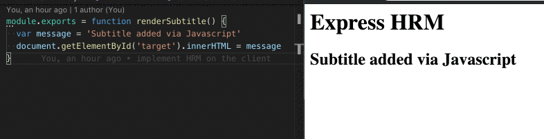

# :fire: Express-Hot-Reloading :fire:
Simple example of how implement webpack hot reloading with express.



## Why
I think I'm not the only one who had some issues while trying to add this
webpack feature in an existing express server.
Even following the documentation didn't work.

So I want this guide to be a working example of how to add HMR on an existing
express server.

## Usage
Clone the repo and install the dependecies via yarn or npm.
```
git clone git@github.com:NicholasPeretti/express-hot-reloading.git
cd express-hot-reloading
yarn
```

Run the server and navigate to [localhost:3000](http://localhost:3000)
```
node index.js
```

Open `src/renderSubtitle.js` and change the message to see the realtime update
on the browser!